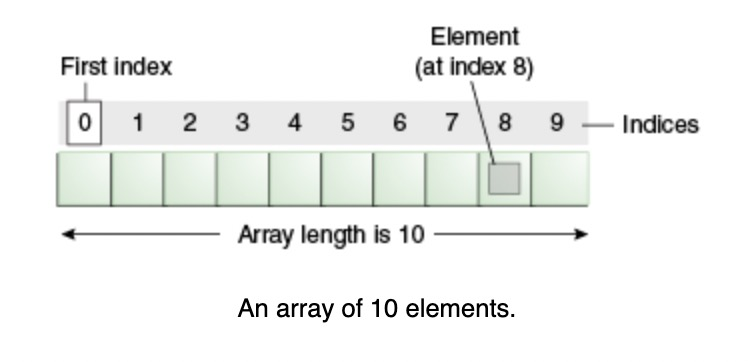

# Java Arrays

## Arrays

An _array_ is a container object that holds a fixed number of values of a single type. The length of an arrya is established when the array is created. After creations, its length is fixed.



Each item in an array is called an _element_, and each element is accessed by its numerical _index_.

```java
class ArrayDemo {
}

```
